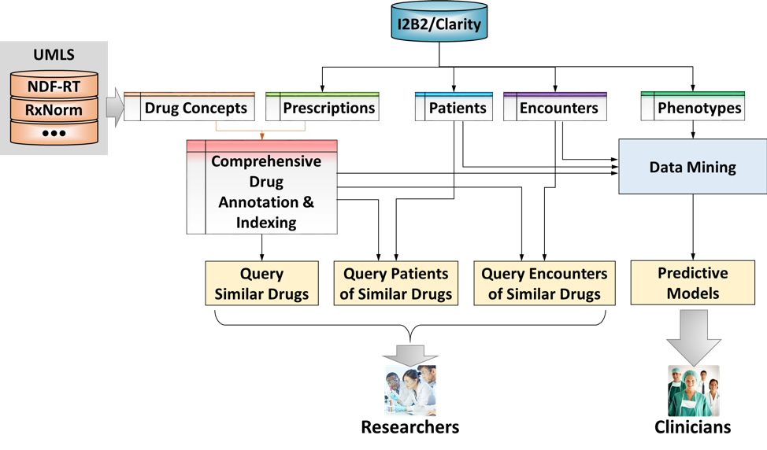
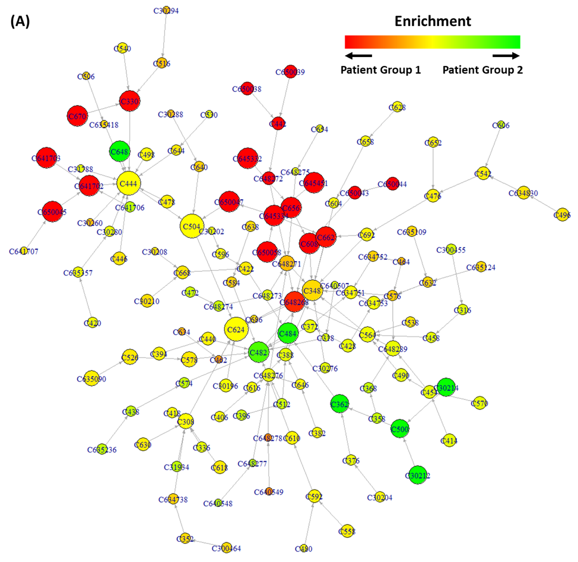

# Summary

The Drug Informatics Studio is an R package designed to provide easy-to-use functions for semantic data mining of the
drug prescription history in electronic medical records (EMR) according to the common biomedical ontologies. 

A patient’s "pharmacy history" provides a unique and essential information domain that reflects health status,
delivered healthcare, treatment responses, comorbidities, and other important clinical features of the patient.
Extracting drug information from EMR and other real-world data and integrating this information in the context of
knowledge bases of drugs and diseases, known as *drug informatics*, plays a pivotal role in medical informatics and
forms the foundation of clinical decision support systems. However, a huge gap remains between the rich and
fast-growing EMR data of drug history and the meaningful and reliable representation of prescribed drugs of an
individual patient. The major challenge lies between the complexity and dynamics of the real-world drug history data
and the underdeveloped informatics approaches to comprehensively and meaningfully represent the health information
behind drug prescriptions and to use drug-related health information in clinical research and patient care.

Drug ontologies comprehensively annotate drugs from multiple perspectives, from mechanisms to associated diseases to
chemical ingredients to known drug interactions. Commonly used drug ontologies and controlled vocabularies include
RxNorm, National Drug Code (NDC), the National Drug File – Reference Terminology (NDF-RT, now the Medication
Reference Terminology: MED-RT) [@RN1], First DataBank (FDB) MedKnowledge and OrderKnowledge, the Anatomical Therapeutic
Chemical (ATC) Classification System, and others. Each drug ontology systematically organizes such annotations with
the relations among them in the form of a heterogeneous directed acyclic graph. Drug ontologies, as well as
controlled vocabularies, are then cross-mapped from one ontology to the other through semantic relations. Together,
drug ontologies and controlled vocabularies as well as the cross-mapping between them form a *pan-ontology drug
semantic network*. Such a network provides the foundation for multi-faceted, extensible, and scalable representations
of health information represented by drugs and the intrinsic similarities among drugs. Thus, mapping drug records
onto this drug semantic network and using semantic similarity metrics for EMR data mining are able to address the
challenge of meaningfully using real-world drug records in clinical research and patient care.

To address this challenge in drug informatics and bridge the gap between the wealth of EMR data and the urgent needs
in clinical informatics research, we developed an ontology-based, integrated research environment, the *Drug
Informatics Studio* [@RN2] \autoref{fig:schema}, to: 1) systematically annotate drugs, encounters, and patients; 2) define
similarity metrics among drugs, encounters, and patients; 3) subtype patients according to their drug history, and 4)
support modeling for precision medicine and clinical decision support. The Drug Informatics Studio is composed of a
pan-ontology network to provide comprehensive ontology support, ontology-indexed drug EMRs to represent drug records
using this network, and an informatics toolbox to enable clinical research using ontology-based drug information.
Currently, the Drug Informatics Studio covers the National Drug File – Reference Terminology (NDF-RT) for medications
as well as associated Unified Medical Language System (UMLS) Metathesaurus ontologies and terminologies, such as
RxNorm, that support the NDF-RT ontologies. Annotations are mainly based on NDF-RT’s drug annotation concepts,
including mechanisms of action (MoA), physiologic effects (PE), and pathophysiologic as well as certain non-disease
physiologic states (Disease). The enrichment of annotation concepts enables clinical research to define similarity
metrics among drugs, subtype patients according their drug history, and support the modeling for precision medicine
and clinical decision support. A set of functions are provided for searching similar drugs using ontological
concepts, identifying patients that use similar drugs, and visualizing which annotation concepts are enriched among
similar patients.

We used simulated data derived from the EMRs of prevalent Wake Forest patients with diabetes to demonstrate the
functionalities of the Drug Informatics Studio. This demonstration cohort of 1,000 virtual patients were simulated
from a WFBH cohort includes 122,632 patients, 342,347 encounters, and 15,918,328 drug records. We performed
annotations as well as drug-based clustering of clinical encounters. We further profiled the enriched clinical
features in these newly discovered clusters. We demonstrated how to use the Drug Informatics Studio to systematically
annotate drugs, index patients’ drug information in the EMR, define similarity metrics among drugs, subtype patients
according to their drug history, and support the modeling for precision medicine and clinical decision support. Such
simulated EMR data are provided to demonstrate the functionalities (for example, MoA concept enrichment analysis
shown in \autoref{fig:moa-tree} and \autoref{fig:moa-lgl}) of the Drug Informatics Studio.

Currently, the U.S. Study to Protect Brain Health Through Lifestyle Intervention to Reduce Risk
(U.S. POINTER)[@RN3, @RN4] is using the Drug Informatics Studio to support the EMR-based participant screening for
targeted recruitment.

# Figures

![Demonstration of MoA concepts differentially enriched in Patient Group 1 and Patient Group 2 in tree layout (A) or
large-graph layout (B). The graph is a subgraph of the MoA ontology, with each node as an MoA concept and each edge
pointing from a more specific MoA concept toward to a more general one. The color represents the relative enrichment
of an MoA concept in Patient Group 1 (red) vs. Patient Group 2 (green). The size of a node represents the logarithmic
frequency of the MoA concept in the overall dataset. MoA concepts of low frequency (less than 20) are not shown.
\label{fig:moa-lgl}](moa-lgl.png)

# Acknowledgement

Research reported in this publication was supported by the National Center for Advancing Translational Sciences of
the National Institutes of Health under Award Number UL1TR001420. The content is solely the responsibility of the
authors and does not necessarily represent the official views of the National Institutes of Health.

# References
